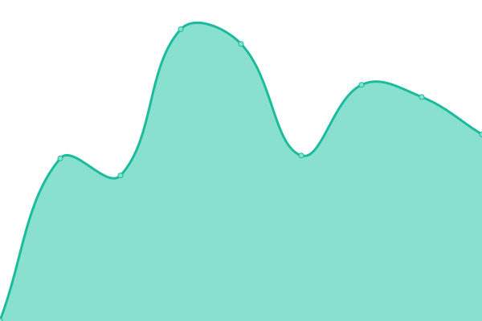

# [📈 Live Status](https://uptime.clong.us): <!--live status--> **🟥 Complete outage**

This repository contains the open-source uptime monitor and status page for [claytonplong](https://uptime.clong.us), powered by [Upptime](https://github.com/upptime/upptime).

With [Upptime](https://upptime.js.org), you can get your own unlimited and free uptime monitor and status page, powered entirely by a GitHub repository. We use [Issues](https://github.com/claytonplong/backup-uptime/issues) as incident reports, [Actions](https://github.com/claytonplong/backup-uptime/actions) as uptime monitors, and [Pages](https://uptime.clong.us) for the status page.

<!--start: status pages-->
<!-- This summary is generated by Upptime (https://github.com/upptime/upptime) -->
<!-- Do not edit this manually, your changes will be overwritten -->
<!-- prettier-ignore -->
| URL | Status | History | Response Time | Uptime |
| --- | ------ | ------- | ------------- | ------ |
|  [www.offsitedatasync.com](https://www.offsitedatasync.com) | 🟥 Down | [www-offsitedatasync-com.yml](https://github.com/claytonplong/backup-uptime/commits/HEAD/history/www-offsitedatasync-com.yml) | 

 2116ms
     
 | 

<a href="https://uptime.clong.us/history/www-offsitedatasync-com">97.29%</a>
    

|  [www.keepitsafe](https://www.keepitsafe.com/) | 🟥 Down | [www-keepitsafe.yml](https://github.com/claytonplong/backup-uptime/commits/HEAD/history/www-keepitsafe.yml) | 

 1566ms
     
 | 

<a href="https://uptime.clong.us/history/www-keepitsafe">96.86%</a>
    

|  [www.livevault](https://www.livevault.com) | 🟥 Down | [www-livevault.yml](https://github.com/claytonplong/backup-uptime/commits/HEAD/history/www-livevault.yml) | 

 1365ms
     
 | 

<a href="https://uptime.clong.us/history/www-livevault">96.38%</a>
    

|  [offsitedatasync.com](https://offsitedatasync.com) | 🟥 Down | [offsitedatasync-com.yml](https://github.com/claytonplong/backup-uptime/commits/HEAD/history/offsitedatasync-com.yml) | 

 2362ms
     
 | 

<a href="https://uptime.clong.us/history/offsitedatasync-com">97.08%</a>
    

|  [keepitsafe](https://keepitsafe.com/) | 🟥 Down | [keepitsafe.yml](https://github.com/claytonplong/backup-uptime/commits/HEAD/history/keepitsafe.yml) | 

 2451ms
     
 | 

<a href="https://uptime.clong.us/history/keepitsafe">98.13%</a>
    

|  [livevault](https://livevault.com) | 🟥 Down | [livevault.yml](https://github.com/claytonplong/backup-uptime/commits/HEAD/history/livevault.yml) | 

 1714ms
     
 | 

<a href="https://uptime.clong.us/history/livevault">97.81%</a>
    

<!--end: status pages-->

[**Visit our status website →**](https://uptime.clong.us)

## 📄 License

- Powered by: [Upptime](https://github.com/upptime/upptime)
- Code: [MIT](./LICENSE) © [claytonplong](https://uptime.clong.us)
- Data in the `./history` directory: [Open Database License](https://opendatacommons.org/licenses/odbl/1-0/)
